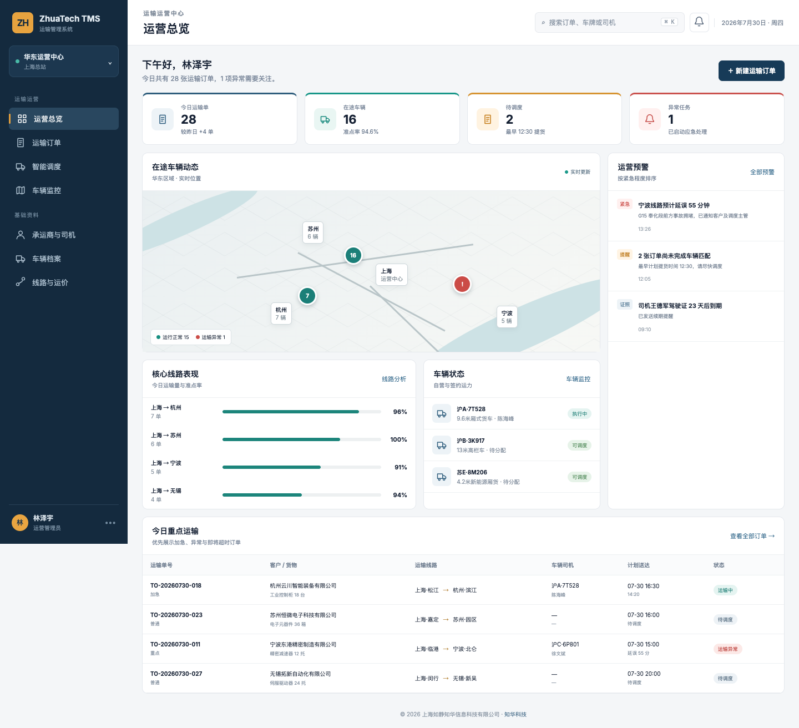
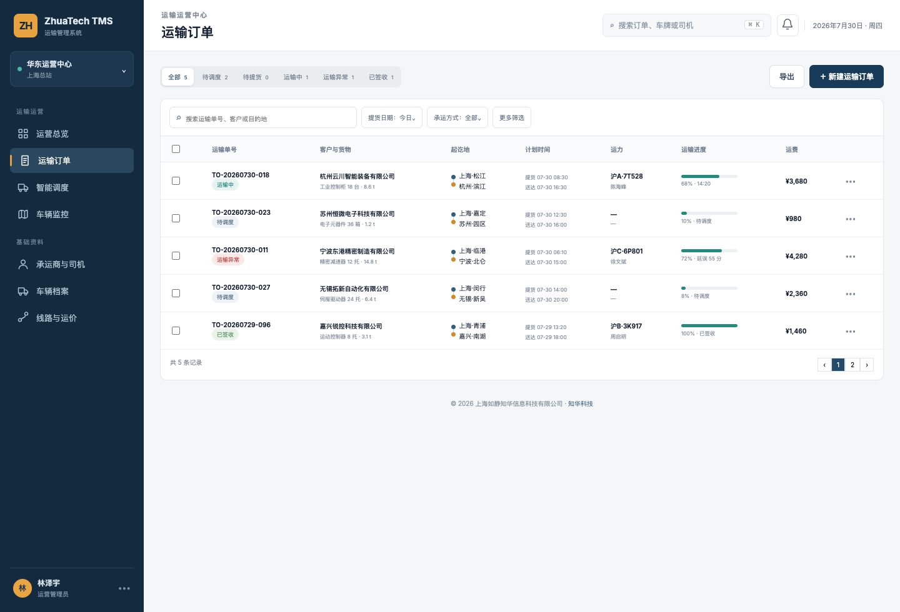
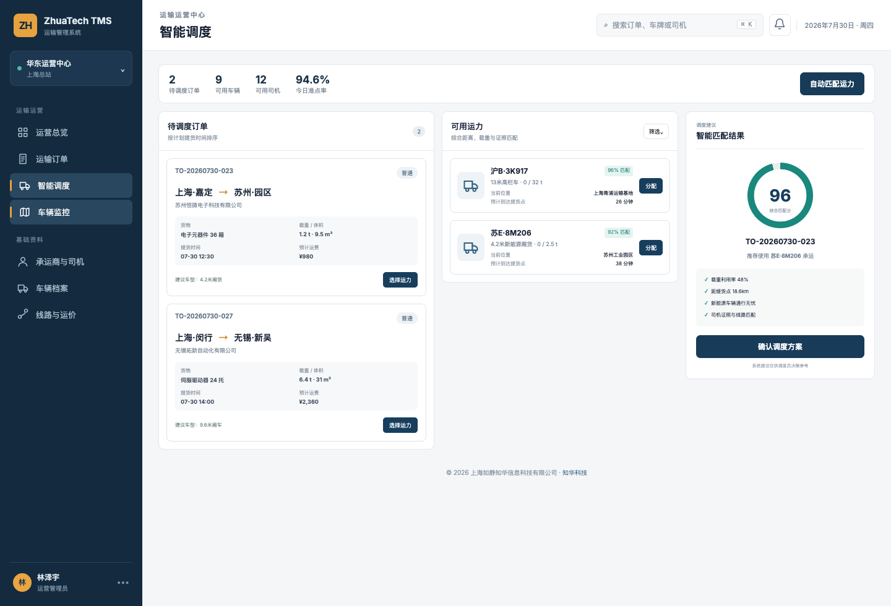
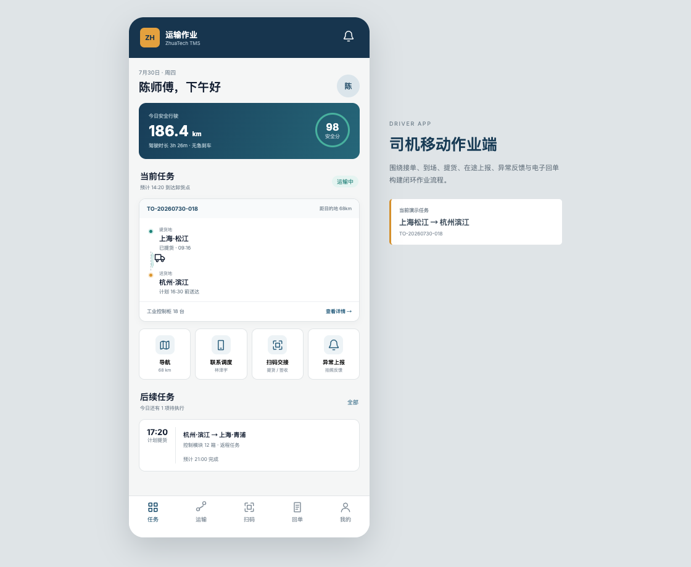
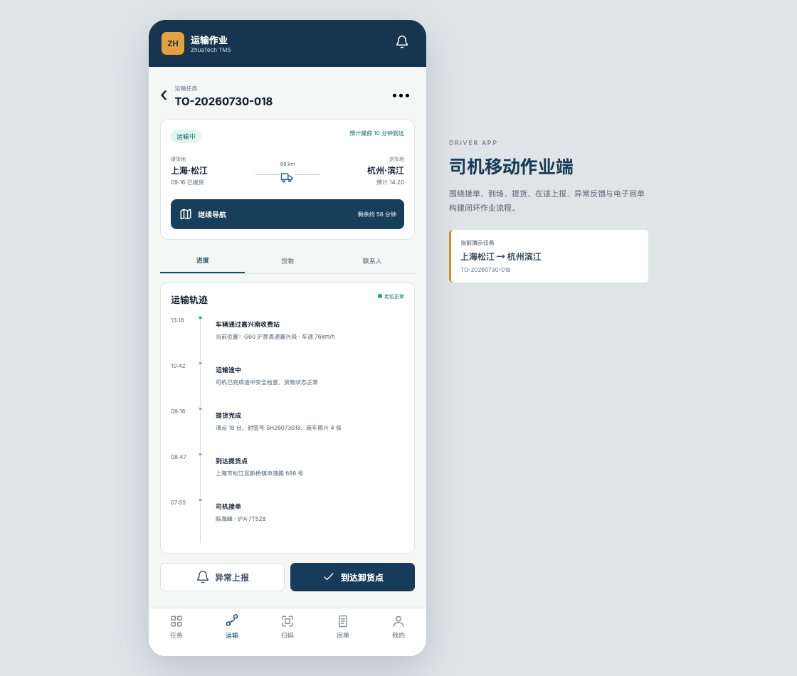

<div align="center">

# ZhuaTech TMS

### 知华科技运输管理系统 · 社区源码版

从运输订单、智能调度到在途跟踪与电子回单，为制造、商贸和物流团队提供可学习、可运行的 TMS 业务样板。

[](backend/pom.xml)
[](backend/pom.xml)
[](frontend/package.json)
[](compose.yaml)
[](LICENSE)

**出品与维护：上海如静知华信息科技有限公司**  
[知华科技官网 https://www.zhuatech.cn/](https://www.zhuatech.cn/)

</div>

## 在途交付风险预判

新增 `POST /api/admin/delivery-risk`，综合剩余里程、平均车速、司机剩余驾驶时长、客户承诺时效和天气风险，计算预计到达时间与延误概率。接口同时输出换驾、绕行和主动通知收货方等可执行建议。

> [!IMPORTANT]
> 本工程仅允许用于个人学习、技术研究和非商业交流，不得商用。企业内部生产使用、SaaS、收费交付、项目投标、咨询实施、培训收费、二次销售及其他商业用途，均须事先获得上海如静知华信息科技有限公司书面授权。具体条款见 [LICENSE](LICENSE)。

## 先看系统

### 运输运营驾驶舱

管理端聚合今日运输量、在途运力、待调度订单、异常预警、核心线路准点率及车辆位置，让运营人员先处理风险，再关注效率。



### 运输订单中心

订单列表围绕客户、货物、起讫地、计划时窗、承运车辆、司机、运输进度与费用展开，支持按状态切换和多条件筛选。



### 智能调度工作台

调度台将待调度订单、可用运力和匹配建议并列呈现，综合载重、容积、距离、车型与司机证照辅助人工决策。



### 司机移动作业端

司机端以任务为中心，覆盖接单、导航、到场、提货、在途上报、异常反馈、扫码交接和电子签收，页面适配 H5 与移动设备。

<table>
  <tr>
    <td width="50%"></td>
    <td width="50%"></td>
  </tr>
  <tr>
    <td align="center">司机任务与快捷作业</td>
    <td align="center">运输进度与轨迹时间轴</td>
  </tr>
</table>

## 这个版本解决什么问题

ZhuaTech TMS 是一个前后端分离的运输管理系统社区源码项目，适合作为 Java TMS、物流管理系统、车队管理系统、运输调度系统和司机 H5 应用的学习参考。它不是只展示菜单的空壳，首版已形成一条可理解的运输闭环：

`运输订单 → 运力匹配 → 司机接单 → 到场提货 → 在途跟踪 → 异常协同 → 客户签收 → 电子回单`

| 业务域 | 社区版能力 |
| --- | --- |
| 运输订单 | 客户、货物、重量体积、起讫地、提送货时窗、优先级和运费 |
| 调度执行 | 司机与车辆资源、可调度状态、车型载重、综合匹配建议 |
| 在途可视 | 车辆当前位置、节点轨迹、预计到达时间、运输进度 |
| 异常管理 | 延误和运输异常上报、运营预警、问题描述与时间记录 |
| 司机作业 | 接单、导航、到场、提货、扫码交接、异常反馈和签收回单 |
| 基础资料 | 车辆、司机、证照、线路及运价的领域结构示例 |
| 权限安全 | JWT 登录，管理员、调度员、司机三类角色权限 |
| 工程能力 | Flyway、Docker Compose、CI、集成测试、协作与安全规范 |

## 工程结构

```text
zhuatech-tms/
├── backend/                       # Java 21 + Spring Boot API
│   └── src/main/java/cn/zhuatech/tms
│       ├── controller/            # 管理端、司机端和认证接口
│       ├── service/               # 订单、调度、轨迹与签收业务
│       ├── model/                 # 运输领域实体
│       ├── repository/            # JPA 数据访问
│       └── security/              # JWT 认证链路
├── frontend/                      # Vue 3 单页应用
│   └── src/views
│       ├── admin/                 # 运营管理端
│       └── driver/                # 司机 H5 作业端
├── docs/                          # API、架构、数据库与页面截图
├── deploy/                        # 部署注意事项
└── compose.yaml                   # MySQL + 后端 + 前端
```

## 技术选型

- 后端：Java 21、Spring Boot 4、Spring MVC、Spring Security、Spring Data JPA、JWT、Flyway。
- 前端：Vue 3、Vue Router、Pinia、Axios、Vite，PC 管理端与 H5 作业端共用工程。
- 数据库：MySQL 8.4；自动化测试使用 H2 的 MySQL 兼容模式。
- 部署：Docker、Docker Compose、Nginx，多阶段镜像构建。
- 工程包名：`cn.zhuatech.tms`，Maven Group 为 `cn.zhuatech`。

## 五分钟本地体验

### 方式一：前端演示模式

无需数据库和后端即可查看全部页面：

```bash
cd frontend
npm install
npm run dev:demo
```

浏览器访问 `http://localhost:5173/admin/dashboard`，司机端访问 `http://localhost:5173/driver/home`。

### 方式二：Docker Compose

```bash
cp .env.example .env
# 修改 .env 中的数据库密码和 JWT_SECRET
docker compose up --build -d
```

默认页面地址为 `http://localhost:8090`，API 地址为 `http://localhost:8080`。

### 演示账号

| 使用端 | 账号 | 密码 | 角色 |
| --- | --- | --- | --- |
| 运营管理端 | `admin` | `admin123` | 管理员 |
| 运营管理端 | `dispatcher` | `dispatch123` | 调度员 |
| 司机作业端 | `driver` | `driver123` | 司机 |

> 演示账号仅用于本地学习。部署前必须删除或修改，并替换数据库密码和 JWT 密钥。

## 开发与验证

```bash
# 后端测试
cd backend && mvn test

# 前端生产构建
cd frontend && npm run build:demo
```

接口清单见 [docs/api.md](docs/api.md)，数据库说明见 [docs/database.md](docs/database.md)，架构说明见 [docs/architecture.md](docs/architecture.md)。

## 适合继续扩展的方向

- 对接地图、轨迹围栏、路径规划和预计到达时间服务。
- 增加承运商门户、询价比价、招投标和运力合同。
- 增加多段运输、零担拼载、波次配载、冷链温控和危险品规则。
- 增加计费规则、对账单、应收应付、开票及财务系统集成。
- 对接 ERP、OMS、WMS、MES、电子面单、短信和企业微信。
- 补充租户隔离、数据权限、审计日志、对象存储和高可用部署。

## 商业授权与深度定制

如果您需要把本项目用于企业生产环境，或需要 TMS 运输管理系统定制、物流数字化咨询、司机端 App、地图轨迹、承运商协同、费用结算、ERP/OMS/WMS 集成与私有化部署，请联系 **知华科技（上海如静知华信息科技有限公司）**。

- 官方网站：[https://www.zhuatech.cn/](https://www.zhuatech.cn/)
- 服务内容：技术咨询、企业信息化、软件项目外包、FDE、AI 落地与行业系统深度开发
- 微信咨询：可扫描下面任意二维码

<table>
  <tr>
    <td align="center"></td>
    <td align="center"></td>
  </tr>
  <tr>
    <td align="center">微信咨询一</td>
    <td align="center">微信咨询二</td>
  </tr>
</table>

## 社区协作

提交问题前请阅读 [CONTRIBUTING.md](CONTRIBUTING.md) 与 [SECURITY.md](SECURITY.md)。请勿提交真实客户、司机、手机号、车牌、轨迹、地址、密钥或生产数据库内容。所有源文件及相关文档的版权归上海如静知华信息科技有限公司所有。

---

<div align="center">

**知华科技 · 让企业信息化建设更务实、更可持续**

© 2026 上海如静知华信息科技有限公司 · [www.zhuatech.cn](https://www.zhuatech.cn/)

</div>
